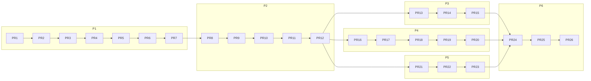

# V1 PR Plan — PR-ready decomposition of the implementation plan

**Purpose:** turn [V1_IMPLEMENTATION_PLAN.md](V1_IMPLEMENTATION_PLAN.md)
(P1–P6, amended by ADR-026) into a sequence of **individually reviewable,
individually mergeable pull requests** — each small enough to review in
one sitting, each leaving the platform releasable, each written so its
Scope section can be pasted into `local-ezai sprint` as a task brief
(self-building where practical).

## 1. Conventions (apply to every PR)

| Aspect | Rule |
|---|---|
| Branch | `feature/p<phase>-<slug>` from `main`; autonomous slices arrive on `swe/*`/`sprint/*` and are cherry-merged into the feature branch by a human |
| Gates | `make swe-test` (311+ tests, all pre-existing tests **unmodified**) + `make swe-lint` + new tests for the PR's own scope; CI green before review |
| Self-review | `local-ezai . review` output attached to the PR description (the platform reviews its own PRs; the human reviewer sees its findings) |
| Docs-as-code | the architecture doc the PR implements is updated from *designed* → *as-built* in the same PR; phase ADR (ADR-027..031) enters `Proposed` in the phase's first PR and flips to `Accepted` in its last |
| Behavior preservation | any diff to a pre-existing test or rendered default is called out in a **"Behavior notes"** section — empty means byte-identical |
| Size budget | S ≤ ~300 net LOC · M ≤ ~800 · L ≤ ~1500 (split anything larger) |
| Merge authority | human (repo owner); no PR merges itself — including evolution-authored ones |
| Rollback note | every PR states how to revert (git revert suffices unless it migrates state — then the PR must ship the down-migration) |

## 2. Dependency graph

P3 / P4 / P5 run in parallel after PR-12; P6 is the release train.

## 3. The PRs

### Phase P1 — Registry v2 · PAL · Lifecycle (ADR-027) — CLI-first, no new services

**PR-1 · Registry v2 store + generations** — M — ✅ **implemented**
([prs/PR-1-registry-v2.md](prs/PR-1-registry-v2.md); 19 tests incl. the
golden test, suite 330 green)
Scope: `config/models/registry.yaml` schema (models × states, ordered
groups reasoning/coding/chat, roles with group/pin/**contract** fields per
MODEL_GOVERNANCE_V2 §3), generation snapshots + diff, load/validate
(resolution-completeness check).
Tests: schema round-trip; resolution algorithm incl. pins, inactive
skipping, loud empty-group failure; **golden test: reproduces today's
CLAUDE.md routing byte-for-byte**; generation diff.
Excludes: any consumer.

**PR-2 · Capability vector + classes + fit()** — S — ✅ **implemented**
([prs/PR-2-capability-fit.md](prs/PR-2-capability-fit.md); 14 tests,
suite 344 green, golden intact)
Scope: detection (`accelerator kind/vram/ram/cores/flags`), class mapping
(`accel-large|accel-small|cpu-standard|cpu-low`, `n97` preset alias), pure
`fit(model, vector)` with conservative verdicts + override flag.
Tests: fixture vectors → classes (H3, H4 seeds); fit verdicts for
reference sizes/quants.

**PR-3 · Runtime descriptors + renderer** — L — ✅ **implemented**
([prs/PR-3-runtime-renderer.md](prs/PR-3-runtime-renderer.md); 34 tests
incl. goldens per legacy profile, suite 378 green, PR-1 golden intact)
Scope: `config/providers/{llamacpp,vllm}.yaml` (six-verb contract of
RUNTIME_ABSTRACTION §2, per-accelerator image tables); renderer producing
LiteLLM config (model + **role aliases**), engine-slot materialization,
runtime role map; drift detection on rendered files; neutral `engine`
network alias added to compose.
Tests: render golden files per (runtime × class); drift refusal;
capability negotiation failures name the missing capability (CF-6).
Behavior notes: existing hand-written LiteLLM configs untouched until
PR-7 (renderer writes to a parallel path until cutover).

**PR-4 · Lifecycle: install / validate / benchmark** — L — ✅ **implemented**
([prs/PR-4-lifecycle-install-benchmark.md](prs/PR-4-lifecycle-install-benchmark.md);
35 tests, suite 413 green, PR-1/PR-3 goldens intact)
Scope: source resolvers (`hf:`, `gguf:` url/path, catalog id), checksummed
resumable download, provider `validate_model`, `bench` absorbing `make
bench`; catalog as pluggable data + requirements-driven recommender
(`auto`); model states registered→installed→benchmarked→failed.
Tests: state machine transitions; resolver matrix; recommender fit
against fixture vectors; benchmark recording into registry + trend file.

**PR-5 · Lifecycle: activate / upgrade / rollback / retire + governance queue** — L — ✅ **implemented**
([prs/PR-5-activation-governance.md](prs/PR-5-activation-governance.md);
22 tests incl. failed-health self-rollback and crash injection, suite 435
green, goldens intact)
Scope: activation request objects (generation diff + evidence), file-backed
approval queue (approve/reject with reason, append-only governance log),
atomic render→reload→health→self-rollback protocol
(MODEL_LIFECYCLE §4), generation rollback, retire/uninstall guards.
Tests: approval-gated activation; failed-health self-rollback; rollback
to generation N; blocked retire of a last serving member; audit records.

**PR-6 · CLI namespaces + role aliases in code** — M — ✅ **implemented**
([prs/PR-6-cli-namespaces-role-aliases.md](prs/PR-6-cli-namespaces-role-aliases.md);
24 tests, suite 459 green, PR-1 golden intact through the alias switch)
Scope: `local-ezai model …`, `governance …`, `project …`, `status`,
`up/down` wrappers; agentd role defaults switch to `role-*` aliases
(**removes the last model names from code — CF-3**); `prepare_run` seeds
from Registry v2 with per-repo ADR-020 overrides preserved.
Tests: CLI integration per verb (scripted); alias binding; ADR-020
override precedence regression suite.
Behavior notes: default model resolution path changes — golden test from
PR-1 must still hold.

**PR-7 · Bootstrap core + `.env` seed consumption + cutover** — M — ✅ **implemented**
([prs/PR-7-bootstrap-cutover.md](prs/PR-7-bootstrap-cutover.md); 23 tests
incl. F8/F10/F11, suite 482 green, goldens intact; **ADR-027 → Accepted**)
Scope: `bootstrap(seed_env) → generation 1` (AI_RUNTIME + three group
seeds, `auto`, consumed-once stamping), legacy `CPU_*/N97_*/CHAT_MODEL_*`
migration (F11), **cutover**: rendered LiteLLM config becomes the real
one; three legacy config variants retired.
Tests: seed parsing matrix (F8 cases), migration goldens, generation-1
diff equals seeds (F10).
Behavior notes: the cutover PR — reviewed with rendered-vs-legacy config
diffs attached. **ADR-027 → Accepted.**

### Phase P2 — `ezaid` control plane (ADR-028)

**PR-8 · Service skeleton** — M — ✅ **implemented**
([prs/PR-8-control-plane-skeleton.md](prs/PR-8-control-plane-skeleton.md);
22 tests, suite 504 green, goldens intact; **ADR-028 → Proposed**)
Scope: OpenAPI app, service-token auth + forwarded identity, append-only
audit log, `/health` aggregation, compose overlay service
(`EZAI_CONTROL_PORT`), versioned spec artifact.
As built: `agentd.control` (FastAPI behind the `agentd[control]` extra),
`agentd/audit.py` shared with the governance queue, contract
`1.0.0-draft.8` at `docs/api/ezaid-openapi.json` (contract-surface
tripwire), opt-in overlay `docker-compose.control.yml` + `make control-*`,
`local-ezai status` shows control health.
**PR-9 · Lifecycle + governance endpoints** — M — ✅ **implemented**
([prs/PR-9-lifecycle-governance-endpoints.md](prs/PR-9-lifecycle-governance-endpoints.md);
22 tests incl. CLI/API parity, suite 526 green, goldens intact)
Scope: expose PR-4/5 operations; idempotency keys; error objects shared
with CLI.
As built: shared operations in `platform_cli` (CLI verbs format, API
serves — parity tested), 19 `/v1` operations with their CLI mapping,
`Idempotency-Key` replay/conflict, `agentd/platform_errors.py` (the CLI
prints the same `{"error": …}` in `--json` mode), audited mutating calls,
reload refused where the daemon cannot run compose; contract
`1.0.0-draft.9`.
**PR-10 · Run endpoints** — M — ✅ **implemented**
([prs/PR-10-run-endpoints.md](prs/PR-10-run-endpoints.md); 11 tests incl.
a real scripted run through the daemon, suite 537 green, goldens intact)
Scope: async run registry (start/status/report/cancel for run/sprint/fix/
evolve), concurrency limits.
As built: `control/runs.py` + `runs_api.py` over the existing pipelines
(+ `plan` as the A0 kind), records under `config/control/runs/` recovered
on restart, cooperative cancellation through the model client, limits
`control.max_concurrent_runs`/`max_queued_runs`, one in-place job per
project, registered projects only and never a push; contract
`1.0.0-draft.10`.
**PR-11 · CLI connected mode** — M — ✅ **implemented**
([prs/PR-11-cli-connected-mode.md](prs/PR-11-cli-connected-mode.md); 17
tests incl. the parity smoke and a real-socket run, suite 554 green,
goldens intact)
Scope: transport auto-detect, identical UX and outputs both modes;
management verbs fail fast offline; parity smoke.
As built: `control/client.py::ConnectedOps` mirrors the direct operations
(verbs format `ctx.ops.*` on either context — same text/JSON/errors),
`--transport auto|connected|direct` / `EZAI_TRANSPORT` / `EZAI_CONTROL_URL`,
a requested connected transport or a token-less reachable daemon fails fast
(exit 2), `bootstrap`/`up`/`down` stay host-only; `status` shows its
transport.
**PR-12 · Phase close** — S — ✅ **implemented**
([prs/PR-12-p2-phase-close.md](prs/PR-12-p2-phase-close.md); 4 tests,
suite 558 green, goldens intact; **ADR-028 → Accepted — P2 closed**)
Scope: kill-the-daemon test, two-concurrent-runs test, spec freeze.
As built: a real `ezaid` process SIGKILLed with repo work unaffected and
management verbs falling back / failing fast; two real scripted runs on
two repositories supervised concurrently through the API plus a gated
cancel pair; contract frozen at `1.0.0` with a 29-operation inventory;
deployment shapes decided (`make control-up` container overlay for model /
governance, `make control-serve` host daemon for SWE runs; `make up` does
not start it in V1). P3 / P4 / P5 are ready in parallel.

### Phase P3 — OpenWebUI integration (ADR-029)

**PR-13 · swe-server MCP tool server** — L — ✅ **implemented**
([prs/PR-13-swe-tool-server.md](prs/PR-13-swe-tool-server.md); 7 tests
incl. the plan → confirm → run → report loop and the catalog's negative
check, suite 565 green, goldens intact; **ADR-029 → Proposed**)
Scope: tool catalog of OPENWEBUI_INTEGRATION §2 (start/inspect only),
project allowlist, mcpo registration, markdown report rendering.
As built: vendored `mcp-servers/swe-server/` (FastMCP, thin over the 1.0.0
contract, no agentd import), twelve tools, refusals rendered as answers,
mcpo `swe` entry + image copy + compose env (`EZAI_CONTROL_URL_MCPO`,
`host.docker.internal`); `swe_test`/`swe_review`/`model_benchmark` deferred
to a 1.1 contract slice; OpenWebUI connection left to PR-14.
**PR-14 · Orchestrator persona** — S: `orchestrator` role entry +
LiteLLM alias (data), system preset, first-run pre-registration.
**PR-15 · Boundary hardening** — M: negative tests proving governance
mutations unreachable from chat; prompt-injection drill script in CI;
regression pass showing chat/RAG byte-identical. **ADR-029 → Accepted.**

### Phase P4 — Admin Center (ADR-030)

**PR-16 · ezaid client + Overview/Runs pages** — L (monitor extension).
**PR-17 · Models/Routing/Runtime pages** — L: role-first cards, fit
badges, explain views, runtime switch pre-check UX.
**PR-18 · Governance queue + approval modal** — M: evidence panels,
approve/reject, deep links.
**PR-19 · Sprints/Evolution/Memory/Projects pages** — M.
**PR-20 · SSO handoff + Browser-QA suite** — M: trusted-header handoff
(Basic fallback), the five zero-CLI journeys of WEBUI_PRODUCT_STRATEGY §5
as Browser-QA workflows in CI. **ADR-030 → Accepted.**

### Phase P5 — First-Run Experience (ADR-031)

**PR-21 · install.sh** — M: capability detect, `.env`
generation/validation with printed fixes **before any download** (F8),
secrets minting, single review-edit stop, re-run repair mode (F5).
**PR-22 · Setup pipeline + smoke** — M: steps 4–8 of
FINAL_FIRST_RUN_EXPERIENCE §3 (fetch→render→up→verify→report), the
"Platform ready" card, `local-ezai init` fallback wizard.
**PR-23 · Offline bundle + FRE acceptance suite** — M: bundle
create/consume, scripted F1–F11 acceptance tests, onboarding Browser-QA'd.
**ADR-031 → Accepted.**

### Phase P6 — Parity, agnosticism proof, release

**PR-24 · Parity harness** — M: CLI-direct vs CLI-connected vs API
state/audit equivalence across the CLI_AND_WEBUI_STRATEGY §3 matrix;
release-gate wiring in CI.
**PR-25 · Agnosticism gates** — M: `mockengine` third-runtime drill
(RUNTIME_ABSTRACTION §6) green with zero diffs outside descriptors;
H1 vendor-string CI audit; H2–H4 fixtures.
**PR-26 · Release train** — M: docs refresh (USER_GUIDE, OPERATION_MANUAL,
CLI_REFERENCE, TROUBLESHOOTING, MAINTENANCE_GUIDE absorb new surfaces),
72 h soak runbook + results, product DoD checklist
(TARGET_PRODUCT_V1 §8) item-by-item, human release sign-off, tag
**v1.0.0**.

## 4. Sizing & sequence summary

| Phase | PRs | Sizes | Parallel with |
|---|---|---|---|
| P1 | PR-1..7 | S:1 M:3 L:3 | — (foundation) |
| P2 | PR-8..12 | S:1 M:4 | — |
| P3 | PR-13..15 | S:1 M:1 L:1 | P4, P5 |
| P4 | PR-16..20 | M:3 L:2 | P3, P5 |
| P5 | PR-21..23 | M:3 | P3, P4 |
| P6 | PR-24..26 | M:3 | — (gate) |

26 PRs total; longest dependency chain PR-1→…→PR-12→(P3/P4/P5)→PR-24→26.

## 5. Risk register (PR-level)

| PR | Risk | Mitigation baked into the PR |
|---|---|---|
| PR-3/PR-7 | LiteLLM/engine reload behavior differs per runtime | render-to-parallel-path first; cutover isolated in PR-7 with diff review; self-rollback protocol tested before cutover |
| PR-5 | half-applied generation on crash | atomic snapshot-then-render + health-gated commit; crash-injection test |
| PR-6 | alias switch changes resolution silently | PR-1 golden test is the tripwire; runs both before/after in the same PR |
| PR-13 | tool surface creep | catalog frozen in the ADR-029 spec; negative tests enumerate forbidden verbs |
| PR-21 | installer bricks an existing install | repair-mode test (F5) is a merge condition |

## 6. Definition of PR-ready (checklist pasted into each PR description)

- [ ] Scope matches this plan's entry (deviations listed and justified)
- [ ] New tests cover the PR's scope; full suite green; lint clean
- [ ] Pre-existing tests unmodified (or diff justified under Behavior notes)
- [ ] Architecture doc updated to as-built; phase ADR status correct
- [ ] `local-ezai . review` findings attached and addressed
- [ ] Rollback note present (revert or down-migration)
- [ ] No model/vendor names introduced into code or defaults (H1 discipline)
