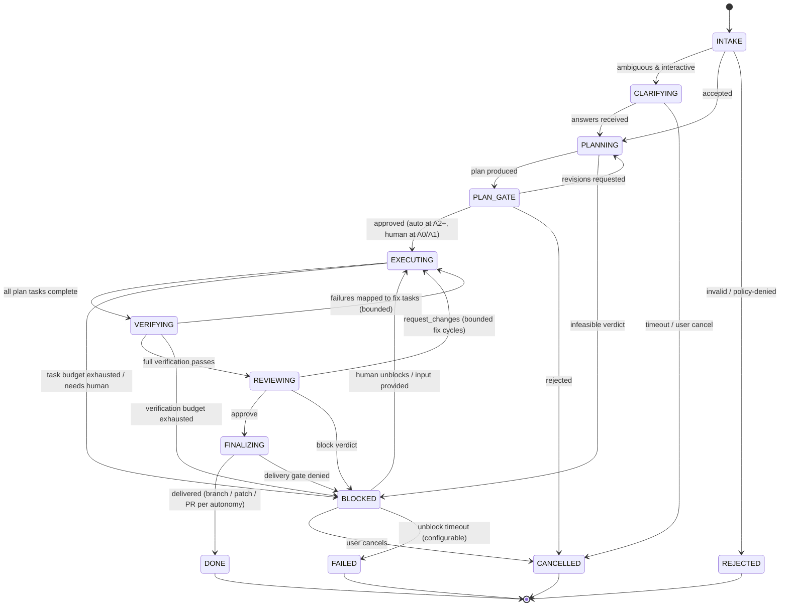
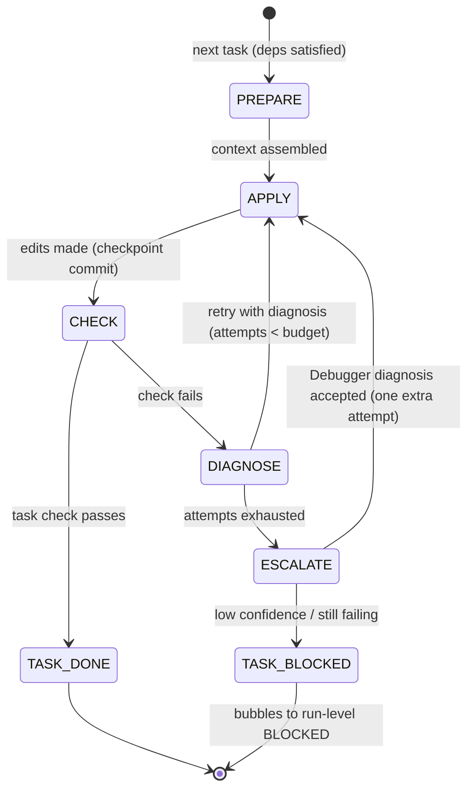

# Workflow Design — Run State Machine

**Date:** 2026-08-14
**Scope:** Requirement 4 — *define the workflow state machine* governing every
autonomous run. Implemented by the workflow engine inside agentd (Phase 3).
Agents referenced here are specified in [AGENT_DESIGN.md](AGENT_DESIGN.md).

Design rules: states and transitions are **code**, never model output; every
transition is a journaled event (ADR-006); the machine is resumable from the
journal at any point; adding a state requires an ADR.

---

## 1. Top-level run state machine

`A0` (dry-run) short-circuits: `PLAN_GATE → FINALIZING` with a proposed-diff
report and no EXECUTING phase writes.

## 2. State definitions

| State | Owner | Entry actions | Exit condition |
|---|---|---|---|
| **INTAKE** | Orchestrator | validate submission (repo exists, autonomy ≤ project max, budgets); create run id, journal, workspace *reservation* | accepted / rejected / needs clarification |
| **CLARIFYING** | Orchestrator | emit question set to the submitting interface | answers, cancel, or timeout |
| **PLANNING** | Planner (+Context agents) | spawn Context brief; produce `Plan v1` | schema-valid plan or infeasible |
| **PLAN_GATE** | Permission engine | render plan for approval per autonomy level | approve / revise / reject |
| **EXECUTING** | Orchestrator → Implementer et al. | create worktree + runner container (first entry); run the **task loop** (§3) over plan tasks in dependency order | all tasks done, or budget/block |
| **VERIFYING** | Tester | run full verification commands; parse results | pass, mapped-failures, or budget out |
| **REVIEWING** | Reviewer (fresh session) | review cumulative diff vs goal | approve / request_changes / block |
| **FINALIZING** | Integrator | clean commits, write summary/PR body; T3 delivery actions per autonomy (gated) | delivered or gate denied |
| **BLOCKED** | human | package full context (state, evidence, options) to interfaces; park runner (paused container, workspace intact) | human action or timeout |
| **DONE / FAILED / REJECTED / CANCELLED** | terminal | final report event; runner torn down; workspace retained per retention policy (FAILED keeps everything for autopsy) | — |

> **Implementation status (Phase 2, ADR-015).** The runtime in `agentd/`
> realizes the PLANNING/EXECUTING/VERIFYING/FINALIZING core of this machine
> as a LangGraph graph, with the inner DIAGNOSE loop implemented as an
> explicit **self-healing sub-machine**:
> `PLAN → CODE → VALIDATE → (failed) DEBUG → FIX → REVALIDATE → …`,
> bounded by `max_heal_iterations` (default 10) and a signature-based
> **stall detector** (`stall_threshold`, default 3) that aborts
> symptom-patching loops. DEBUG combines a deterministic RCA engine (error
> categorization per §7's taxonomy) with a read-only Debug Agent emitting
> structured `DebugReport`s. PLAN_GATE, CLARIFYING, REVIEWING, BLOCKED, and
> journal-replay resume remain future phases of this design.

## 3. Inner task loop (within EXECUTING, per plan task)

- **PREPARE:** Context manager assembles the task window: project memory,
  task envelope, RepoBrief slice, relevant diff-so-far. Compaction runs here.
- **APPLY:** Implementer edits; every batch ends in a checkpoint commit
  (rollback unit).
- **CHECK:** the *task-local* check declared in the plan (fast: targeted
  tests/compile) — full-suite verification is the VERIFYING state's job.
- **DIAGNOSE:** structured failure → either self-retry (Implementer) or
  ESCALATE to the Debugger, per attempt budget (AGENT_DESIGN §5).
- Rollback rule: a retry that makes things worse (`check regressions >
  baseline`) resets to the last good checkpoint before the next attempt.

## 4. Events (journal vocabulary)

`RUN_SUBMITTED, RUN_VALIDATED, STATE_ENTERED(state), AGENT_SPAWNED(role),
AGENT_RESULT(role, envelope_ref), TOOL_CALLED(tool, tier, decision),
TOOL_RESULT(ref), GATE_REQUESTED(kind), GATE_RESOLVED(kind, by, verdict),
CHECKPOINT(commit), VERIFICATION(ref), REVIEW(ref), BUDGET_WARN(kind),
BUDGET_EXHAUSTED(kind), COMPACTION(evicted_ref, summary_ref),
DELIVERY(ref), RUN_TERMINAL(state, reason)`

Every event: monotonic sequence number, wall time, actor, payload ref.
**Resume = replay:** agentd rebuilds machine state and context from the
journal; in-flight tool calls found without results are re-issued if
idempotent (T0/T1) or surfaced to DIAGNOSE if mutating.

## 5. Gates & bounded cycles

| Gate | Where | A0 | A1 | A2 | A3 |
|---|---|---|---|---|---|
| Plan approval | PLAN_GATE | report only | human | auto | auto |
| T3 action (push/PR/memory write) | any | n/a | human | human | auto (policy-scoped) |
| T4 action | any | denied | denied | denied | denied |
| Review fix-cycle limit | REVIEWING→EXECUTING | n/a | 1 | per budget | per budget |
| Verify fix-cycle limit | VERIFYING→EXECUTING | n/a | 2 | per budget | per budget |

Cycle counters are per-run, monotonic, and journaled: the machine **cannot
loop forever** — exhausting any cycle budget forces BLOCKED with evidence.

## 6. Concurrency & scheduling

- Run-level: one active run per repo by default (worktrees make >1 safe
  later; serialized in v1 for verification-resource sanity). Global cap per
  profile (N97: 1; GPU: configurable).
- Within EXECUTING: independent plan tasks may run Context/Implementer
  sub-agents in parallel up to the sub-agent budget; **verification is
  always exclusive** per workspace.
- Queued submissions wait in INTAKE-accepted state (`QUEUED` sub-status).

## 7. Failure taxonomy → machine response

| Failure | Response |
|---|---|
| Model/tool transient error (timeout, 5xx) | bounded retry with backoff at the step level; journaled |
| Structured-output parse failure | bounded re-prompt with schema errors; then DIAGNOSE |
| Check/test failure | normal DIAGNOSE path (this is the loop working, not an error) |
| Budget exhaustion | controlled wrap-up → BLOCKED (never mid-write kill) |
| Sandbox/runner crash | workspace intact (git); runner recreated; step replayed |
| agentd crash | resume-from-journal on restart; parked runs enter BLOCKED after grace |
| Permission denial (T3/T4) | ask-gate or hard stop per tier — never silent skip |
| Human timeout in BLOCKED | FAILED with full autopsy bundle retained |

## 8. Deliverables per terminal state

- **DONE:** branch `swe/<run-id>` (+ PR at A3), run report (goal, plan,
  diffstat, verification evidence, review verdict, lessons), journal.
- **FAILED / BLOCKED-expired:** autopsy bundle — last good checkpoint,
  failing evidence, diagnosis trail; workspace retained.
- **All states:** the journal is the contract — UIs, metrics, and the Memory
  Curator consume it; no side-channel state exists.
